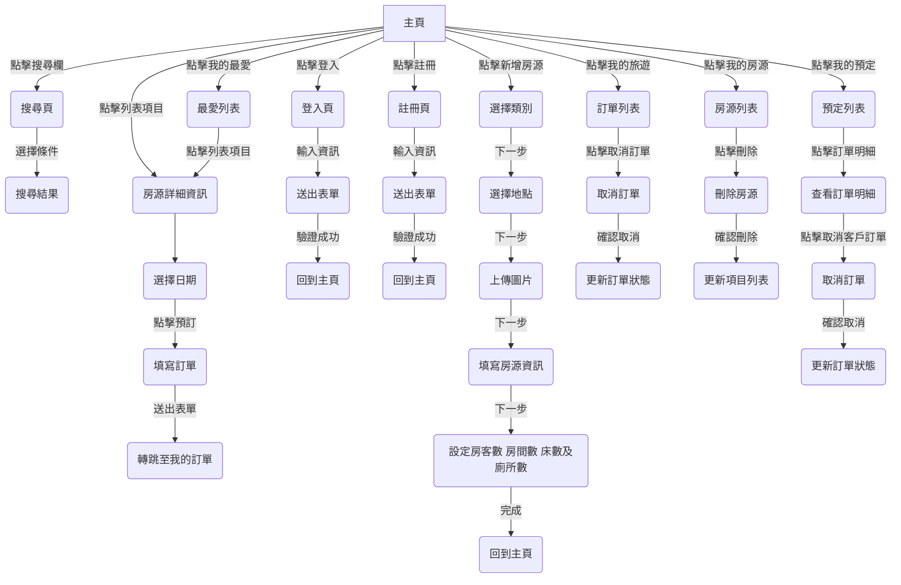
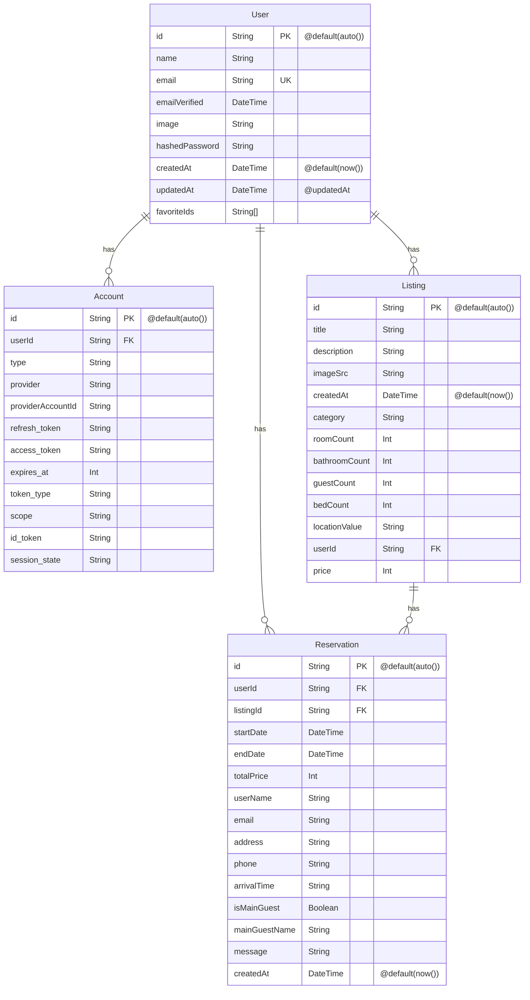

# 訂房網站專案

本專案是一個基於 Next.js 13 app directory 開發的全端模擬 AirBnB 訂房網站，使用 TypeScript 和 TailwindCSS 等技術。並使用 NextAuth.js 進行會員管理，資以 Prisma 作為與 MongoDB 串連的資料庫工具。

## 作品網址
- [Reservation](https://reservation-example.vercel.app/)
  - 帳號：test@email.com
  - 密碼：test12345

## 目錄
- [訂房網站專案](#訂房網站專案)
  - [作品網址](#作品網址)
  - [目錄](#目錄)
  - [工具](#工具)
  - [專案特色](#專案特色)
  - [網站地圖](#網站地圖)
  - [資料庫架構圖](#資料庫架構圖)
  - [Demo](#demo)
    - [登入頁面](#登入頁面)
    - [房源列表](#房源列表)
    - [租房頁面](#租房頁面)
    - [訂房頁面](#訂房頁面)
    - [會員管理](#會員管理)
  - [作者](#作者)

## 工具
- Next.js 13
- TypeScript
- Tailwind CSS
- NextAuth.js
- Prisma
- MongoDB
- React-select
- React-leaflet
- Next-cloudinary
- Next-auth
- React-date-range
- Zustand
- React-hot-toast
- React-hook-form
- React-spinners

## 專案特色

- 房源列表
  - 可以類別的做篩選。
  - navbar 搜尋欄中更可以對時間、地點、房間數、人數、廁所數做篩選。
  - 以 query string 的方式傳遞篩選條件。
- 租房頁面
  - 第一步是選擇類別
  - 第二步是選擇地點，並以 react-select 作為下拉選單套件搭配 react-leaflet 地圖的套件進行地點的選擇
  - 第三步是上傳圖片，使用 next-cloudinary 作為圖片庫的儲存庫套件
  - 第四步是填寫房源的資訊
  - 第五步是設定房客數、房間數、床數及廁所數
  - 完成後即可將資料寫入資料庫
- 訂房頁面
  - 每個 listing 點進去可以有各自的房源的頁面
  - 使用 react-date-range 製作月曆的 ui 及日期日期選擇功能
  - 按下一步跳出 dialog 視窗，顯示訂購資訊，並填寫訂購人訊息
  - 送出表單將資料寫入資料庫
- 會員管理
  > 使用者可以透過登入註冊系統，管理自己的個人資訊。在登入後，使用者可以點選會員選單中各項功能
  - 「我的旅遊」查看已訂購的房源
  - 「我的最愛」查看自己收藏的房源
  - 「我的預定」查看自己房源的所有訂單，並可以查看訂單明細及取消客戶的訂單
  - 「我的房源」來查看及刪除自己的房源。
  - 使用者也可以透過 Google、GitHub 等 OAuth 登入系統。
- 資料庫設計
  >使用 Prisma 作為與 MongoDB 串聯的資料庫工具，其中 User 對 Account、Listing、Reservation 都是一對多的關聯，其中 Listing 對 Reservation 也是一對多關聯。
- 通知管理 : 使用 react-hot-toast 套件來顯示通知。
- 表單管理 : 使用 react-hook-form 套件來管理表單。
- 頁面加載 : 建立 `loading` 頁面使用 react-spinners 套件來顯示頁面加載的動畫。
- 錯誤頁面 : 若使用者進入不存在的路由或發生錯誤，將會跳轉至 `error` 頁面，提示使用者發生錯誤的原因。

## 網站地圖

## 資料庫架構圖

## Demo
### 登入頁面

### 房源列表

### 租房頁面

### 訂房頁面

### 會員管理

## 作者
藍奕欣
[Github](https://github.com/ysl0628) 
LinkedIn: [藍奕欣](https://www.linkedin.com/in/奕欣-藍-100371248/) 
Email: yihsinlan@gmail.com
